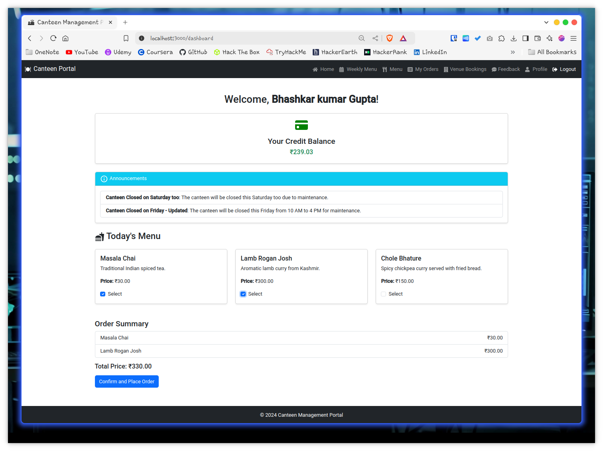
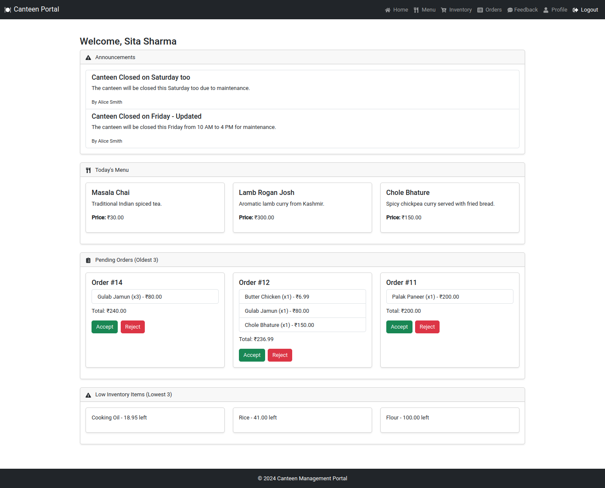
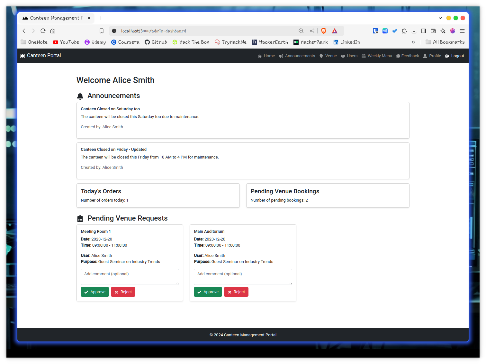

# Canteen Management Portal

Welcome to the  **Canteen Management Portal** , a full-stack web application designed to streamline and manage canteen operations. This portal allows users to place orders, manage inventory, book venues, provide feedback, and more. Built using  **Node.js** ,  **React.js** , and  **PostgreSQL** , the system offers an efficient solution for managing canteen activities with real-time tracking and role-based access control.

## Features

### 🔑 **User Authentication & Role-Based Access**

* Secure login and registration using **bcryptjs** for password hashing and **jsonwebtoken (JWT)** for authentication.
* Role-based access for  **Users** ,  **Admins** ,  **Cooks** , and  **Root Users** , each with tailored functionalities.
* Password reset and profile management for all users.

### 🍽️ **Menu Management**

* Admins and cooks can create, update, and delete menu items with essential details like description, price, and availability.
* Weekly menu planning to help users view upcoming dishes.
* Real-time stock status with automatic updates for item availability.

### 🛒 **Order Management**

* Users can browse the menu and place orders, with details such as item description, price, and availability.
* Users can track the status of their orders (pending, accepted, rejected, completed).
* Cooks can manage incoming orders, approve or reject them, and handle order volume efficiently.

### 📊 **Inventory Management**

* Cooks and admins can manage inventory items such as ingredients and utensils.
* Real-time tracking of inventory usage, with automatic stock deductions based on user orders.
* Low stock alerts to ensure the kitchen is always well-supplied.

### 📅 **Venue Booking**

* Users can request venue bookings for canteen-managed venues, specifying the date, time, and purpose.
* Admins can approve or reject venue bookings with comments to users, ensuring transparent communication.
* Full venue management system to track booking status and availability.

### 📢 **Announcements**

* Admins and cooks can create and manage announcements for users, such as canteen updates or event notifications.
* Announcements are prominently displayed to users on their dashboard for easy access to important information.

### ⭐ **Feedback & Ratings**

* Users can leave feedback on their orders and rate menu items.
* Admins and cooks can view and respond to feedback, allowing for continuous improvement in service quality.
* Venue-specific feedback to enhance the user experience in booking and using canteen venues.

### 💰 **Credit System**

* Users have a credit balance displayed on their dashboard, which deducts with every placed order.
* Admins can add credits to user accounts as needed.

## Technologies Used

* **Backend** : Node.js, Express.js
* **Frontend** : React.js, Bootstrap
* **Database** : PostgreSQL with Sequelize ORM
* **Authentication** : JSON Web Tokens (JWT), bcryptjs
* **Security** : Helmet, express-rate-limit for API protection
* **Email Notifications** : Nodemailer (for future scope)
* **Progressive Web App (PWA)** : Ready for PWA capabilities for mobile-like app experiences.

## Future Enhancements

* **Real-Time Notifications** : Real-time updates for order statuses and low inventory alerts.
* **Multi-Factor Authentication** : Enhancing security with additional authentication factors.
* **Native Mobile App** : Expanding the portal into fully native iOS and Android applications.
* **Image Support** : Adding images for menu items to improve user experience.
* **Payment Gateway** : Integration for online payments directly through the portal.

## User Dashboard

## Cook Dashboard

## Admin Dashboard

